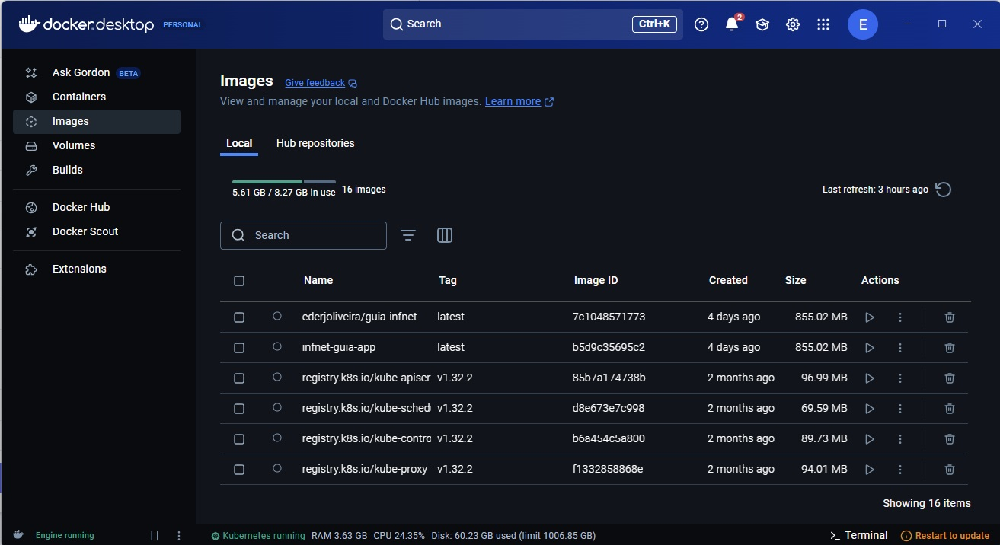

**Curso:** Pós em Arquitetura de Software. 
**Aula:** Integração Contínua, DevOps e Computação em Nuvem 
**Ano Semestre:** 25E1_3 

# Integração Contínua, DevOps e Computação em Nuvem [25E1_3]

Entrega de trabalho.

### Desafio:

1. Utilize o Docker para criar uma imagem personalizada de alguma aplicação previamente feita por você.

    - Publique a sua imagem no Docker Hub.

2. Suba sua imagem em algum cluster kubernetes, seguindo as seguintes especificações:

    - Utilize Deployment para subir sua aplicação com 4 réplicas.
    - Exponha sua aplicação de modo que ela fique acessível fora do Cluster (NODEPORT).
    - Se sua aplicação fizer uso de banco de dados, crie um POD com o mesmo e deixe-o acessível através do ClusterIP. Se sua aplicação não fizer uso de um BD suba uma imagem do Redis e crie um ClusterIP para o mesmo.
    - Crie algum probe para sua aplicação (Readness ou Liveness.)

3. Crie a estrutura para monitorar sua aplicação com o Prometheus e o Grafana (ou qualquer ferramenta a sua escolha: você deve ter um servidor de métricas e alguma ferramenta para dashboards).
    - Apenas o Grafana deverá ficar acessível para fora do Cluster.
    - Utilize um PVC para escrever os dados do Prometheus de maneira persistente.
    - Crie dashboards do Grafana que exponha dados sensíveis da sua aplicação (memória, cpu, etc.)

4. Utilize o Jenkins (ou qualquer ferramenta) para criar um pipeline de entrega do seu projeto.

5. Execute um stress test do seu projeto e tire print do Dashboard sofrendo alterações.

# Imagens do Docker Desktop
* Container:

* Imagens 
    * Locais:
    
    * Hub
    

# Usando kubernetes

* Deployment com 4 réplicas:

* Deployment da aplicação:

* Probe para a aplicação: (vide conforme arquivo Guia-deployment.yaml)

# Estrutura para Monitorar a aplicação
* Informações do Kubernetes sobre os Pods, Deployments e Servicos.

* Sistemas de Monitoramento deverá ficar acessível fora do cluster.

> Atenção devido a aula do dia 8 de abril não ter sido gravada, não pude verificar como é feito a comunicação entre o Grafana e a Aplicação. Lembro ao examinador que as terças-feiras eu participo do Culto da minha igreja.

* Utilizar o Jenkins para subir a aplicação.

* Arquivo Yaml do git action:

> Aqui o conforme acordado poderia fazer o Git Actions, se o examinador achar importante, pode verificar o arquivo da solução 

# Arquivo do Deployment do Kubernetes:

